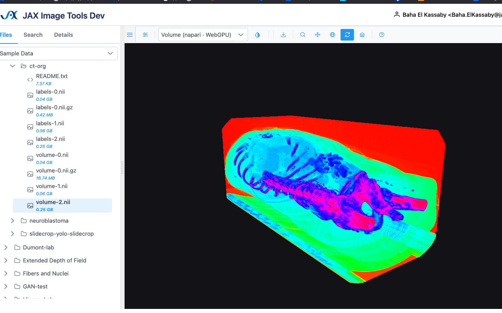
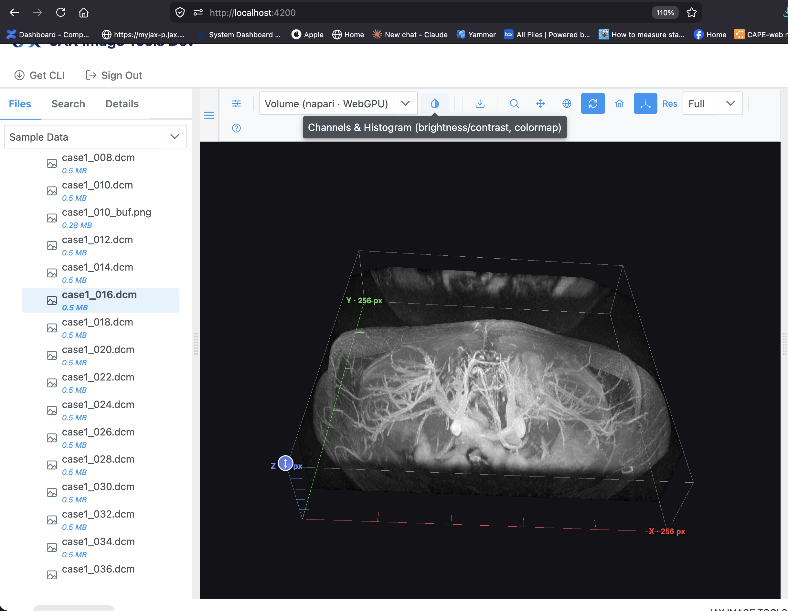
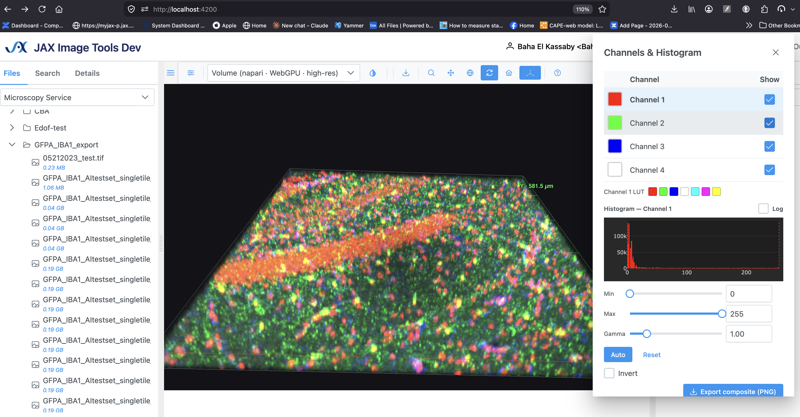
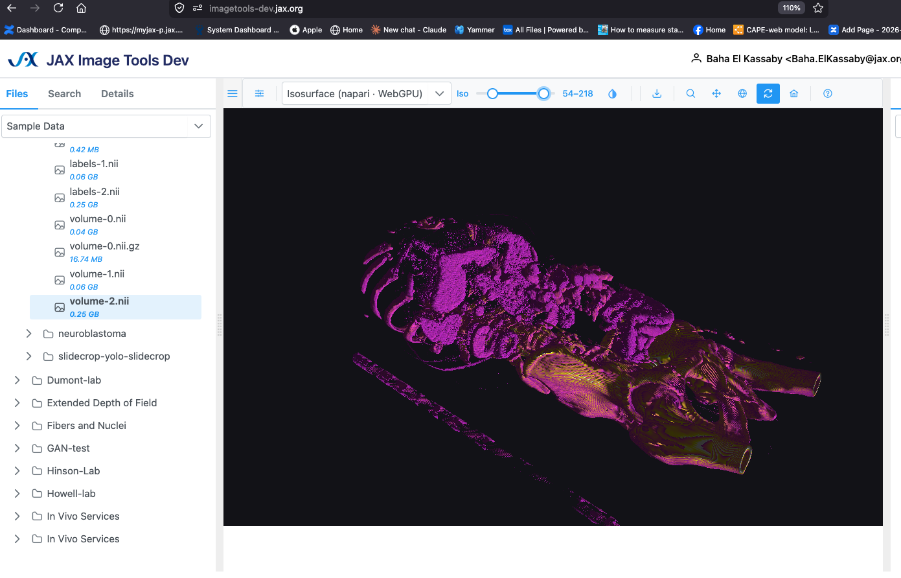

# napari-js

A browser-native, **WebGPU** rendering engine that ports the visualization model of
[napari](https://napari.org) (the Python multi-dimensional image viewer) to TypeScript.

> **Status:** **published to npm — `npm install napari-js`** (latest: **v0.11.1**). napari-js
> implements the POC called for in
> [jit-ui#102](https://github.com/TheJacksonLaboratory/jit-ui/issues/102) — a browser-based
> napari shipped as a JS library. The renderer (NJ-0…NJ-5+) is complete and browser-verified,
> and napari-js now ships **in production** as the WebGPU backend of
> [`sci-image-visualizer`](#used-in-production-sci-image-visualizer) — the engine behind the
> **JAX Image Tools** viewer. See the [CHANGELOG](./CHANGELOG.md).

## Features

- **WebGPU rendering**, 100% client-side — no Python, Pyodide, WASM, or server.
- **Image layers**: single- and multi-channel, `uint8` / `uint16` / `float32`, with live
  colormap (LUT), contrast limits, gamma, invert, opacity, and blend modes
  (`opaque` / `translucent` / `additive` / `minimum`).
- **Tiled & pyramidal** large images with level-of-detail + an LRU GPU-tile cache, and
  **z-stacks** — fed by a pluggable `TextureSource` (typed arrays or `ImageBitmap` tiles).
- **Points** (instanced SDF markers) and **Labels** (`uint8`/`uint16`/`uint32` ids, cyclic palette).
- **3D volume raymarching** — MIP, translucent, and iso-surface, with an orbit camera.
- **Surface** — a 3D triangular mesh (napari's `Surface` layer) with per-vertex colormapping and
  depth-tested flat shading, plus a `heightField` helper that turns a 2D image into a surface plot.
- **Readback**: displayed-pixel readout, PNG screenshot, and per-channel histograms.
- **Host-friendly**: device-loss recovery, `ResizeObserver` auto-resize, and
  `canvasToWorld` / `worldToCanvas` / `visibleWorldRect` for overlays and picking.

## Install & use

```bash
npm install napari-js
```

```ts
import { Viewer } from 'napari-js';

const viewer = new Viewer({ canvas: document.querySelector('canvas')! });
await viewer.ready; // WebGPU device acquired

// one layer per channel; composited additively on the GPU
viewer.addImage(channel0, { colormap: 'green', blending: 'additive', contrastLimits: [0, 4095] });
const dapi = viewer.addImage(channel1, { colormap: 'blue', blending: 'additive' });
dapi.gamma = 0.8; // live — updates a uniform, no texture re-upload

viewer.addPoints(points, { size: 12, faceColor: [1, 1, 0, 1] });
viewer.addLabels(labelImage, width, height, { opacity: 0.5 });
```

A layer's data is any `TextureSource` input: an `ImageBitmap`, a typed-array descriptor
(`{ kind: 'typed', width, height, channels, dtype, data }`), or a pyramidal
`{ kind: 'tiled', …, fetchTile }`. Full API in [docs/02](./docs/02-public-api.md).

## Develop

```bash
npm install
npm run dev          # serve the playground (dropdown: image · multi-channel · tiled · points+labels · volume · surface)
npm test             # GPU-free unit tests (Vitest)
npm run test:coverage
npm run typecheck && npm run lint && npm run format:check
npm run build        # library bundle + types → dist/
```

`npm run dev` serves `index.html` → `playground/main.ts`. Pick a demo from the dropdown to
verify each render path; if WebGPU is unavailable the page shows the reason instead of crashing.

## What this is

napari-js is a **standalone, framework-agnostic** library. It renders large
multi-dimensional / multi-channel scientific images in the browser on the GPU, with
napari's model: a `Viewer` holding a list of `Layer`s (Image, later Points / Labels /
Volume), each with its own colormap (LUT), contrast limits, gamma, opacity, and blending.

It is **not** a port of napari's Python code or its Qt GUI. It is a faithful port of
napari's _rendering concepts_ — the layer→visual model, per-layer GPU colormapping,
serializable transforms and camera — onto WebGPU and WGSL. See
[`docs/07-napari-concept-mapping.md`](./docs/07-napari-concept-mapping.md).

## Why

WebGPU now ships in all major browsers (late 2025). napari's strengths — GPU
multi-channel fluorescence compositing, live scalar colormapping, and volume rendering —
are exactly the things current browser image viewers do poorly or on the CPU. napari-js
brings those strengths to the web as a reusable npm package.

## Where it fits

```
~/git/napari                Reference: the Python renderer being ported (napari/_vispy, layers, components)
~/git/napari-js             THIS repo: the standalone TS + WebGPU port, published to npm
~/git/sci-image-visualizer  Main consumer: wraps napari-js as its WebGPU IVisualizer backend
```

napari-js is built and published independently. Its main downstream consumer is
[`@jax-data-science/sci-image-visualizer`](#used-in-production-sci-image-visualizer), the
Angular visualization library behind **JAX Image Tools**, which registers napari-js as its
WebGPU `IVisualizer` backend alongside OpenSeadragon and Plotly. See [Used in
production](#used-in-production-sci-image-visualizer) below; the original design of that seam
is in [`docs/06-jit-ui-integration.md`](./docs/06-jit-ui-integration.md).

## Used in production: sci-image-visualizer

napari-js is the **WebGPU rendering backend** of `@jax-data-science/sci-image-visualizer`
(v0.2.2) — The Jackson Laboratory's Angular 17 library for interactive scientific image
visualization, and the engine behind the **JAX Image Tools** viewer shown below.

`sci-image-visualizer` is a ports-and-adapters library: every renderer implements one
`IVisualizer` contract, and a router (`RoutingVisualizerService`) picks one per plot type.
napari-js sits alongside two other backends and is the **production default** for 3D:

| What's rendered                        | Backend                                                                              |
| -------------------------------------- | ------------------------------------------------------------------------------------ |
| **3D Volume, Isosurface, Surface**     | **napari-js (WebGPU)** — production default, Plotly fallback                         |
| napari 2D image & scatter modes        | napari-js (WebGPU), with OpenSeadragon / Plotly fallback                             |
| Gigapixel whole-slide · other 2D plots | OpenSeadragon / Plotly (napari-js 2D image opt-in via `VizConfig.useNapariRenderer`) |

- **Dependency:** a plain npm dependency — `"napari-js": "^0.11.1"` — bundled, not a peer dep.
- **Adapter:** `NapariVisualizerService` (`@Injectable`, `implements IVisualizer`) constructs
  one `Viewer`, awaits `viewer.ready`, and dispatches by plot type.
- **DI wiring:** `provideVisualization()` registers all three backends and binds the
  `VISUALIZER` token to the router.

### How it's called

Condensed from `NapariVisualizerService` (the volume / isosurface path). One `Viewer` drives
every 3D mode — the only thing that differs between the screenshots below is the `rendering`
flag and how many channels are pushed in:

```ts
import { Viewer, MultiChannelVolumeView, tintColormap, type VolumeChannel } from 'napari-js';

// created once, when the host mounts the visualizer
const viewer = new Viewer({ canvas, background: { r: 0.07, g: 0.07, b: 0.09, a: 1 } });
await viewer.ready;

// Volume & Isosurface both go through a MultiChannelVolumeView:
//   · one additive, tinted channel per fluorescence channel → multi-channel volume
//   · a single colormapped channel                          → grayscale / CT volume
const view = new MultiChannelVolumeView(viewer);
const channels: VolumeChannel[] = state.channels.map((ch) => ({
  data: ch.volume, // Uint8Array, length width*height*depth, x-fastest
  width,
  height,
  depth,
  colormap: tintColormap(ch.color), // black → channel colour
  contrastLimits: [ch.min, ch.max],
  gamma: ch.gamma,
  visible: ch.visible,
}));

// rendering: 'mip' for the Volume mode, 'iso' for Isosurface
const rendering = isIsosurface ? 'iso' : 'mip';
view.render(channels.length > 1 ? 'multichannel' : 'grayscale', channels, { rendering });

// the toolbar's live "Iso" slider maps straight onto the volume layer's setters
// (updates a GPU uniform — no data re-upload):
volumeLayer.rendering = 'iso';
volumeLayer.contrastLimits = [isoMin, isoMax];
volumeLayer.isoThreshold = 0.5;
```

2D images use the sibling `MultiChannelImageView` (`render('multichannel' | 'grayscale' |
'rgb', views, { interpolation })`); the region-centroid scatter, 3D point cloud, height-field
surface, and axes gizmo call `viewer.addPoints`, `viewer.addPoints3D`, `heightField` +
`viewer.addSurface`, and `viewer.addAxes` directly.

### In the JAX Image Tools viewer

Each shot is a different napari-js render mode, chosen from the toolbar's visualizer dropdown:

<table>
  <tr>
    <td width="50%">
      
      <br /><sub><b>Volume (napari · WebGPU)</b> — MIP raymarch of a CT volume (ct-org <code>volume-2.nii</code>) through a scalar colormap.</sub>
    </td>
    <td width="50%">
      
      <br /><sub><b>Volume + axes</b> — grayscale MIP of a DICOM series with the 3D scale/axes gizmo (<code>addAxes</code>) and the Channels &amp; Histogram controls.</sub>
    </td>
  </tr>
  <tr>
    <td width="50%">
      
      <br /><sub><b>Multi-channel volume</b> — four fluorescence channels composited additively on the GPU (one tinted <code>VolumeChannel</code> each), with live per-channel LUT / contrast / gamma.</sub>
    </td>
    <td width="50%">
      
      <br /><sub><b>Isosurface (napari · WebGPU)</b> — <code>rendering: 'iso'</code> on the CT volume, threshold driven live by the toolbar's <code>Iso</code> slider.</sub>
    </td>
  </tr>
</table>

## Docs

| Doc                                                                      | Contents                                                                                |
| ------------------------------------------------------------------------ | --------------------------------------------------------------------------------------- |
| [00 — Feasibility](./docs/00-feasibility.md)                             | Why this is feasible: napari architecture findings, what ports cleanly, what's hard     |
| [01 — Architecture](./docs/01-architecture.md)                           | Engine module layout, render loop, design principles                                    |
| [02 — Public API](./docs/02-public-api.md)                               | The `Viewer` / `Layer` / `Colormap` / `TextureSource` API surface                       |
| [03 — RenderState IR](./docs/03-render-state-ir.md)                      | The serializable intermediate representation between model and GPU                      |
| [04 — WGSL rendering plan](./docs/04-wgsl-rendering-plan.md)             | Shader pipelines: image+colormap, multi-channel compositing, future raycasting          |
| [05 — Roadmap](./docs/05-roadmap.md)                                     | Milestones NJ-0 … NJ-5+                                                                 |
| [06 — jit-ui integration](./docs/06-jit-ui-integration.md)               | The `IVisualizer` adapter design — now shipped in `sci-image-visualizer`                |
| [07 — napari concept mapping](./docs/07-napari-concept-mapping.md)       | How each napari concept maps to napari-js                                               |
| [08 — Landscape & related work](./docs/08-landscape-and-related-work.md) | Does a browser napari exist? CZI/roadmap WIP, Viv/vizarr/ndv, and how napari-js differs |

## Acknowledgments

napari-js is an independent TypeScript reimplementation of the visualization model of
[napari](https://napari.org) — the Python n-dimensional image viewer
([github.com/napari/napari](https://github.com/napari/napari), BSD-3-Clause). The layer
model, naming, and rendering semantics follow napari's; all credit for that design goes to
the napari core developers and its community. This project is not affiliated with or
endorsed by the napari project.

## License

MIT — see [LICENSE](./LICENSE).
